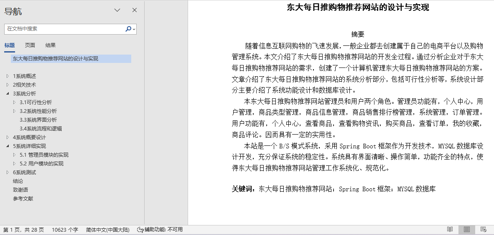
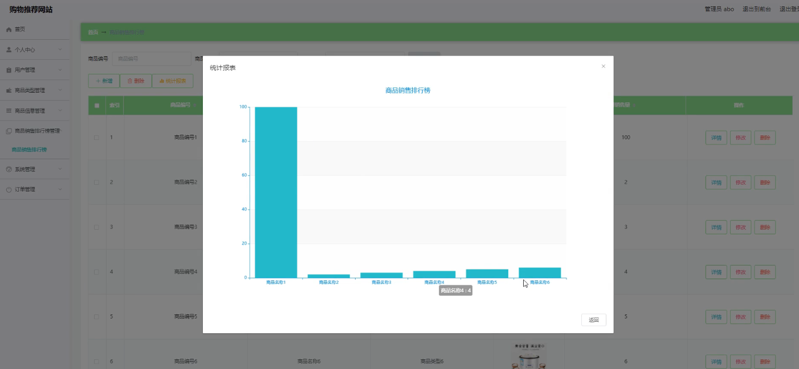
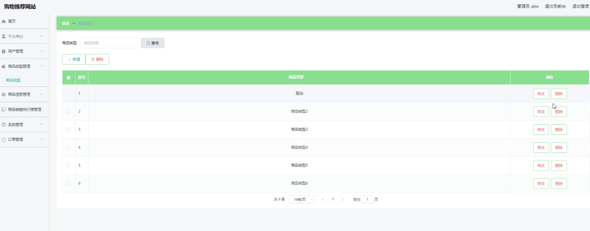
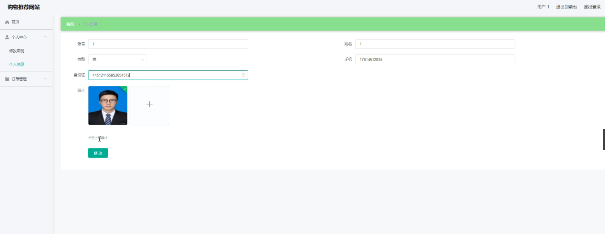
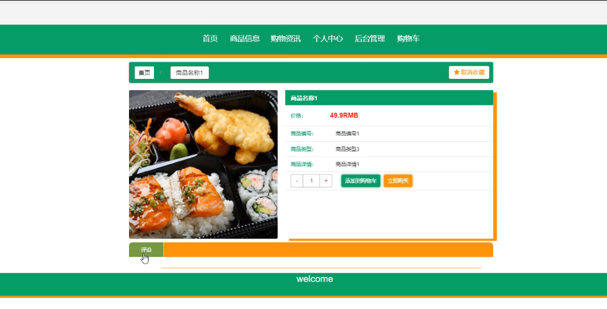
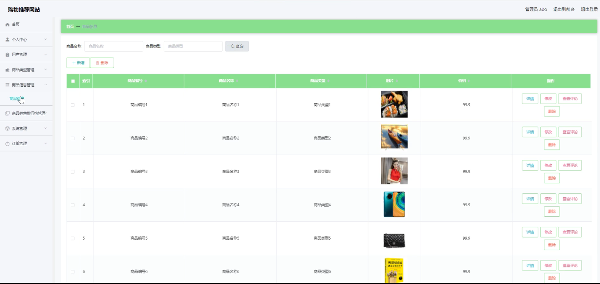

## 基于SpringBoot的购物推荐网站系统(程序+报告)

###  获取sql数据库文件: 从戎源码网 (https://armycodes.com/) QQ: 386869957 QQ群: 377586148
###  所有系统地址: (https://github.com/YuLin-Coder/AllProjectCatalog) 
###  所有项目以及源代码本人均调试运行无问题 可支持远程安装部署调试、定制修改、代码讲解

## 项目介绍
基于SpringBoot的购物推荐网站系统，系统包含两种角色：用户、管理员，系统分为前台和后台两大模块，主要功能如下：

### 【管理员】:
- 商品信息管理: 管理员可以对商品信息进行添加、修改、删除等操作，以管理商品的详细信息。
- 销售排行统计: 管理员可以对销售数据进行统计，以生成销售排行报告和数据分析。
- 商品类型管理: 管理员可以管理商品类型，包括添加、修改和删除商品类型信息。

### 【用户】:
- 个人信息: 用户登录后可以修改自己的注册信息，包括个人资料的更新和管理。
- 商品: 用户登录后可以查看商品信息，并进行购买操作，包括浏览商品的详细信息和选择购买。
- 我的订单管理: 用户可以查看和管理自己的订单，包括订单的状态、详情和历史记录。

## 项目技术
- 编程语言：Java
- 数据库：MySQL
- 项目管理工具：Maven
- 前端技术：HTML、CSS、JavaScript、Jquery、Vue
- 后端技术：Spring、SpringMVC、MyBatis

## 运行环境
- JDK版本：JDK1.8及以上
- 开发工具：IDEA、Ecplise、Myecplise都可以
- 数据库: MySQL5.7及以上
- Maven：maven3.0及以上
- Node：14.14.0及以上

## 运行截图

